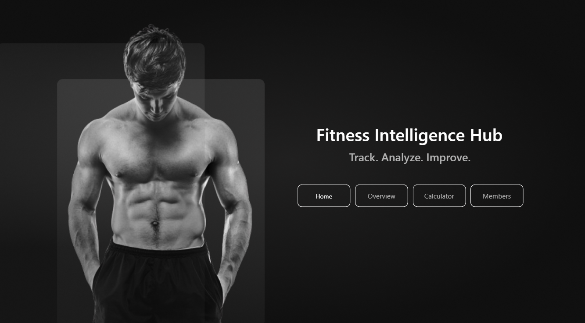
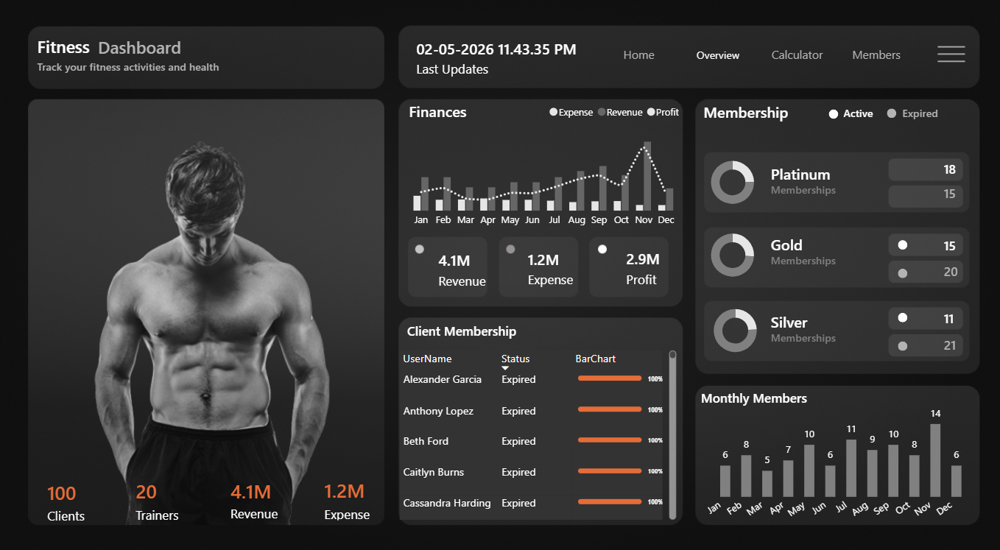
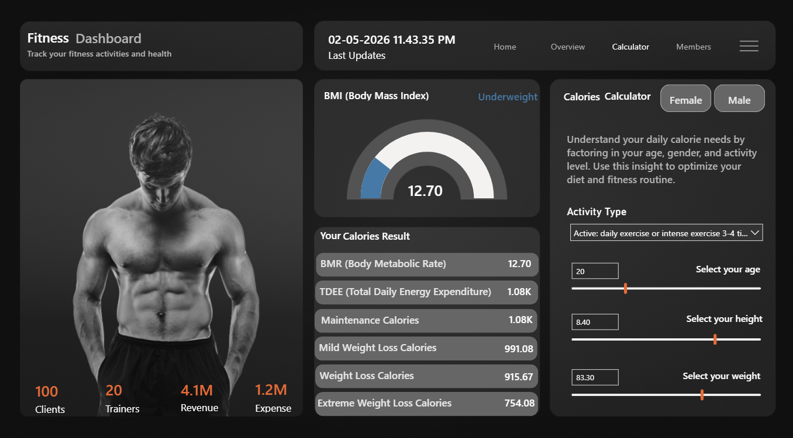
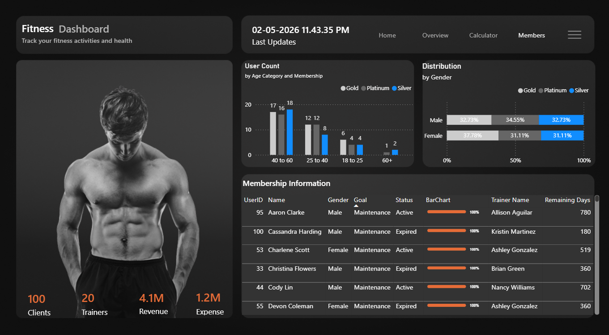

# 🏋️ Fitness Intelligence Dashboard


A modern **Power BI dashboard** designed to analyze fitness metrics, monitor health indicators, and generate actionable insights through interactive visualizations and data-driven calculations.

## 📊 Overview

This project transforms raw fitness data into meaningful insights by combining health calculations with interactive dashboard design.

### Focus Areas
- Body composition analysis
- Calorie estimation
- Membership insights
- Fitness performance tracking
- Financial analytics

## ⚙️ Features

- BMI calculation with category detection
- BMR & TDEE calorie estimation
- Goal-based calorie recommendations
- Interactive sliders (Age, Height, Weight, Activity)
- Membership analytics (Active vs Expired)
- Revenue, Expense & Profit overview
- Dynamic dashboard filtering

## 🖥️ Dashboard Preview

### Home Dashboard


### Overview Dashboard


### Fitness Calculator


### Member Insights


## 🛠️ Tools & Technologies

- Power BI
- DAX (Data Analysis Expressions)
- Data Modeling
- UI/UX Dashboard Design

## 📌 Key Insight

This project demonstrates how analytics can support informed fitness decisions by combining health metrics, financial insights, and interactive visual storytelling.

## 📁 Project Structure

```bash
📦 Fitness-Intelligence-Dashboard
├── dashboard/
│   └── Fitness_Dashboard.pbix
├── data/
│   └── dataset.xlsx
├── images/
│   ├── home.png
│   ├── overview.png
│   ├── Calculator.png
│   └── members.png
